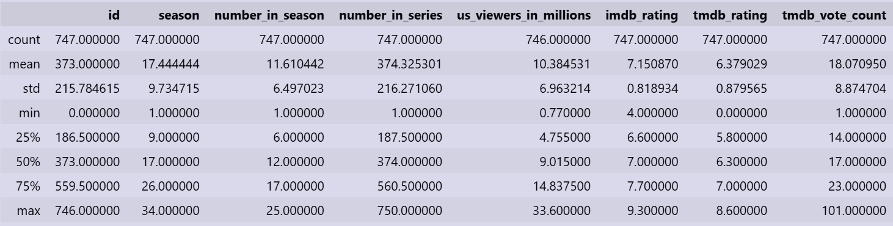
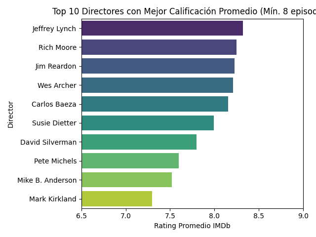
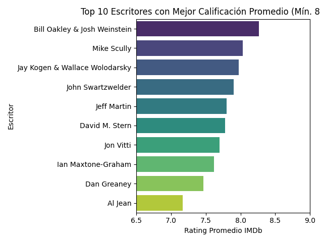
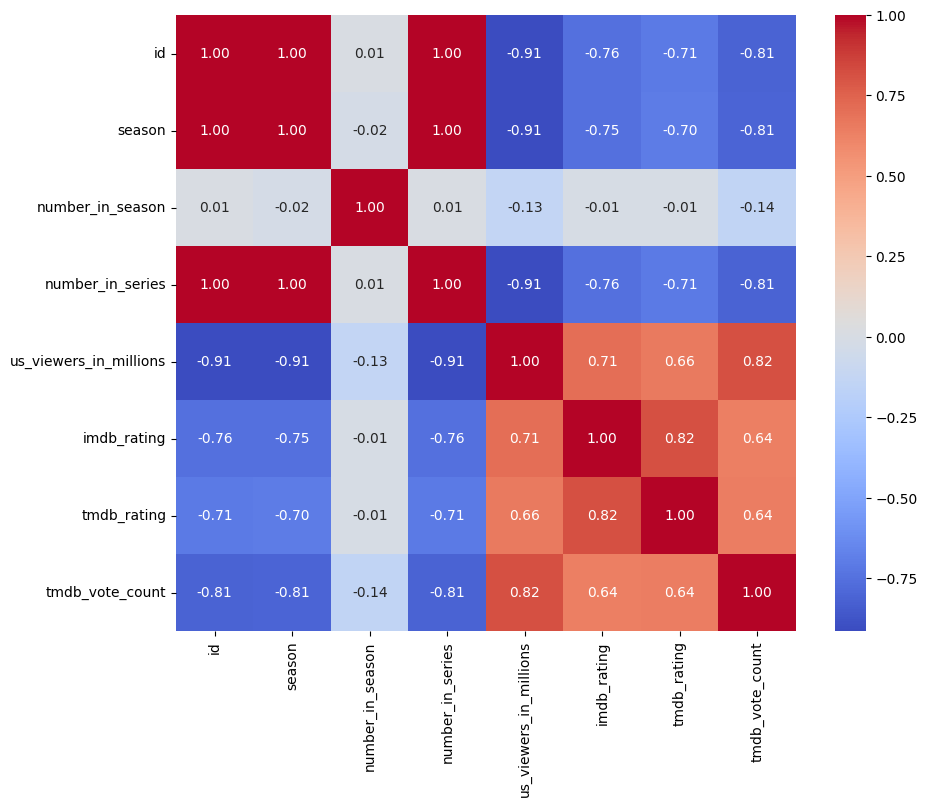
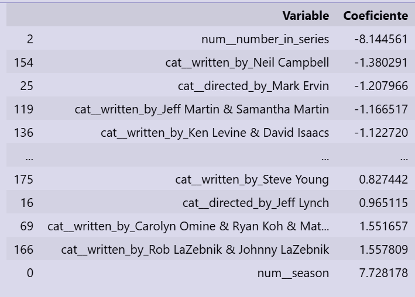

# Proyecto-1-IA-Los-Simpsons
Desarrollo de Proyecto 1 de Introducción a la Inteligencia Artificial 

## Definición del problema

### Claridad y Relevancia

El proyecto está basado en la serie norteamericana "Los Simpsons" que a lo largo de sus 39 años ha experimentado éxitos y grandes valores de sintonía como en la valoración de su audiencia. El problema consiste en analizar qué características de los episodios están asociadas a una mejor recepción por parte del público y desarrollar un modelo capaz de predecir la calificación IMDb de un episodio a partir de variables relacionadas con su producción y desempeño. Entre estas variables se consideran la temporada, el número de episodio, la audiencia en millones de espectadores, los responsables de dirección y escritura. Permitiendo todo esto comprender qué factores influyen directamente en el éxito prolongado del show.

## Plan de acción

### Descripción del dataset y fuente

El dataset contiene información de episodios de Los Simpsons. Cada registro representa un episodio e incluye variables descriptivas relacionadas con su producción, emisión y recepción por parte del público. Las principales columnas disponibles son:

- season: temporada a la que pertenece el episodio.
- number_in_season: número del episodio dentro de la temporada.
- number_in_series: número total dentro de la serie.
- directed_by: director(es) del episodio.
- written_by: guionista(s) responsables.
- us_viewers_in_millions: audiencia en millones de espectadores.
- tmdb_rating: valoración promedio en TMDB.
- tmdb_vote_count: cantidad de votos registrados en TMDB.
- imdb_rating: valoración promedio en IMDb.

Para poder explorar de manera más específica los datos se realizarán análisis exploratorios y correlaciones. Por otro lado, el dataset fue seleccionado y descargado de la plataforma [Kaggle] (https://www.kaggle.com/datasets/jonbown/simpsons-episodes-2016?select=simpsons_episodes.csv). 

## Modelo(s) seleccionado(s) y estrategia de evaluación claramente explicados

Se seleccionó un modelo de Regresión Lineal, utilizando como variable objetivo la calificación IMDb (imdb_rating). El modelo buscará estimar la puntuación de un episodio a partir de las características disponibles en el conjunto de datos, analizando la relación entre las variables predictoras y la calificación de IMDb, así como la capacidad del modelo para estimar dicha puntuación.
Para la evaluación, el conjunto de datos se dividirá en entrenamiento (80%) y prueba (20%). Posteriormente, sobre el conjunto de entrenamiento se aplicará validación cruzada K-Fold con k=5, con el fin de obtener una estimación más robusta del desempeño del modelo antes de realizar la evaluación final sobre el conjunto de prueba. El rendimiento se analizará mediante las métricas R², MAE y RMSE.

### Justifiación de modelo: ventajas, limitaciones y pertinencia.

Se seleccionó la Regresión Lineal debido a que la variable objetivo del estudio, imdb_rating, corresponde a una variable numérica continua. Este tipo de modelo permite analizar y cuantificar la relación existente entre una variable dependiente y múltiples variables explicativas, por lo que resulta adecuado para estimar la valoración de un episodio a partir de sus características. 

Entre sus principales ventajas se encuentran su simplicidad de implementación y facilidad de interpretación. Además, permite identificar qué variables tienen una mayor influencia sobre la calificación IMDb mediante el análisis de los coeficientes asociados a cada predictor. Como limitación, la regresión lineal supone que existe una relación lineal entre las variables analizadas, por lo que puede que no llegue a representar correctamente patrones más complejos. Sin embargo, este modelo resulta pertinente para el problema planteado, ya que permite predecir una variable numérica como la calificación IMDb e identificar qué factores influyen en la valoración de los episodios. Además, destaca por ser un modelo simple, fácil de interpretar y adecuado para un análisis exploratorio inicial.

## Metodología aplicada (paso a paso)

### Paso 1: Carga de librerías y data:

El proyecto parte con la preparación del entorno en Python, cargandao Pandas y NumPy para ordenar las tablas y hacer cálculos, y Matplotlib junto con Seaborn para generar los gráficos. Para la parte del entrenamiento y predicción se incluyen los elementos de la librería Scikit-Learn, además dentro de esta se incluye la validación cruzada y el Grid para buscar los smejores parámetros del modelo. También se incorporó OneHotEncoder y StandardScaler para transformar los nombres de los directores y escritores que son categóricos, usando ColumnTransformer y el Pipeline para juntar todo el preprocesamiento de la data así como los regularizadores que penalizarán el overfit si es que hay. Finalmente se incluyen las métricas de errores; el error cuadrático medio (MSE) y error absoluto medio (MAE).  
Luego de configurar las librerías, se cargó el dataset hasta la fila 10, las filas desplegadas permiten ver el orden de las columnas también y su estructura como se aprecia en la imagen:

.png)

### Paso 2: EDA

El dataset de capítulos de Los Simpsons contiene 14 columnas las cuales fueron detalladas en la descripción del dataset más arriba. Además, hay 747 filas correspondiente a 747 episodios de distintas temporadas. Al revisar la integridad del dataset mediante *data.isnull().sum()*, se confirma que los datos están prácticamente completos, registrando un único valor nulo en la columna *us_viewers_in_millions*, el cual corresponde a la audiencia en EE.UU. de un solo episodio. Por otra parte, al ejecutar *data.duplicated().sum()* el resultado es 0, lo que demuestra que no existen filas idénticas clonadas en su totalidad. Cabe destacar eso si que las repeticiones en columnas como directores, guionistas o temporadas son completamente normales ya que un mismo director trabaja en varios episodios y las temporadas tienen muchos capítulos. 

### Descripción del dataset

Siguiendo con la exploración inicial de la data, la siguiente imagen presenta la descripción detalladas de las columnas y sus estadísticos:

* **count**: Muestra la cantidad de datos válidos que hay. La mayoría de las columnas dicen 747.000000 (747 episodios), pero us_viewers_in_millions dice 746.000000. Significa que hay 1 episodio al que le falta el dato de audiencia, tal como se vio en el estudio de datos nulos y su cantidad. 

* **mean**: se puede ver el promedio histórico de la serie. La serie promedia 17.4 temporadas, actualmente va en la temporada 37 con más de 800 episodios pero al momento de crear este dataset se consideraron solo 747. Además tiene una sintonía histórica promedio de 10.38 millones de espectadores por capítulo y la "nota" promedio en IMDb es de 7.15 dentro del rango de 1 al 10.

* **std**: la desviación estándar muestra que la audiencia es de 6.96, lo que significa que la sintonía ha cambiado drásticamente entre temporadas; alguinos capítulos con muchísima gente y otros con muy poca.

* **min (Mínimo)**: es el punto más bajo registrado con el peor capítulo de Los Simpson teniendo un 4.0 en IMDb. Y el capítulo menos visto tuvo apenas 0.77 millones de espectadores.

* **max (Máximo)**: la serie al momento de la creación de este dataset tiene un máximo de 34 temporadas, su capítulo más visto tuvo 33.6 millones de espectadores y el capítulo mejor evaluado de la historia llegó a 9.3 en IMDb.

* **Respecto a los percentiles de 25%, 50% y 75%**: el análisis del imdb_rating muestra que la calidad de la serie se concentra en rangos bien marcados. El 25% de los episodios tiene una nota de 6.60 o menos, lo que representa las etapas con menor desempeño. Por otro lado, la amediana es la mitad del show y se ubica exactamente en 7.00; al ser una nota más baja que el promedio general de 7.15, se demuestra que un grupo de capítulos clásicos y muy exitosos empuja la media hacia arriba. Finalmente, el 75% de la serie alcanza como máximo un 7.70, lo que significa que solo un 25% de los episodios logra superar esa barrera.

A continuación, se estudiaron las variables categóricas del dataset de directores y escritores, desplegando la cantidad exacta de episodios dirigidos:

| Director | Cantidad de Episodios |
| :--- | :---: |
| Mark Kirkland | 83 |
| Steven Dean Moore | 82 |
| Bob Anderson | 64 |
| Matthew Nastuk | 57 |
| Mike Frank Polcino | 39 |
| Jim Reardon | 35 |
| Chris Clements | 32 |
| Rob Oliver | 32 |
| Nancy Kruse | 26 |
| Wes Archer | 25 |

Y escritos por cada persona para identificar a los realizadores más frecuentes del programa:

| Guionista | Cantidad de Episodios |
| :--- | :---: |
| John Swartzwelder | 55 |
| Joel H. Cohen | 32 |
| Tim Long | 27 |
| J. Stewart Burns | 25 |
| Michael Price | 25 |
| John Frink | 24 |
| Matt Selman | 24 |
| Jeff Westbrook | 22 |
| Jon Vitti | 22 |
| Carolyn Omine | 19 |

Para entender cómo se relacionan la recepción crítica (IMDB y TMDB) y la popularidad de los episodios, se generaron cuatro boxplots combinando distintas variables del dataset:

* Boxplot 1: Calificaciones de IMDb.
* Boxplot 2: Calificaciones de TMDB.
* Boxplot 3: Calificaciones de Audiencia en millones.
* Boxplot 4: Calificaciones de Distribución de votos.

Se realizaron boxplots únicamente para las variables numéricas continuas que aportaban algo sustancial (imdb_rating, tmdb_rating, us_viewers_in_millions y tmdb_vote_count), ya que son las más adecuadas para analizar su distribución y detectar posibles valores atípicos. Las variables discretas, como el número de temporada o de episodio, no aportan información relevante mediante este tipo de gráfico.

1. Distribución de Calificaciones IMDb:
Este boxplot analiza el comportamiento de las notas en la plataforma IMDb, donde califican expertos en el tema y profesionales de la industria. El 50% central de los episodios se concentra de dos maneras; parte en una nota de 6.6 aprox, siendo el 25% con peor puntaje y llega hasta el 7.7 aprox que corresponde al 75%. La línea del medio, que es la mediana, queda exactamente en 7.0; como está un poco por debajo del promedio general de 7.15, se nota a simple vista que los capítulos clásicos hacen la balanza hacia arriba. Por el lado de los mejores episodios, el gráfico sube hasta la nota máxima de 9.3. En cambio, para los valores más bajos el límite normal cae hasta los 5.0 puntos y, debajo de eso, quedan tres capítulos sueltos como valores atípicos (en 4.4 y dos en 4.0), que son oficialmente los peores evaluados de toda la serie.

2. Distribución de Calificaciones TMDB: 
Este boxplot de caja para las notas de TMDB nos muestra que esta comunidad es un poco más exigente, siendo calificada por los usuarios y no por los directores o especialistas en el tema. El 50% central de los capítulos se mueve en un rango más bajo que el de IMDb: empieza en 5.8 y llega solo hasta 7.0 aaprox. La línea del medio, es decir, la mediana corta justo en 6.3, lo que confirma que en TMDB las calificaciones suelen ser más bajas a nivel general. Por la parte de arriba, los mejores episodios evaluados llegan hasta una nota de 8.6. En la parte de menores calificaciones el límite normal cae hasta los 4.0 puntos, pero por debajo de eso aparecen dos valores atípicos; un capítulo en los 3.3 puntos aprox y un episodio con una nota de 0.0, lo que podría ser un error de registro.

3. Distribución de Audiencia en EE.UU:
Este boxplot muestra los datos de la audiencia en televisión, y de todos los gráficos del análisis, este es el que tiene los datos más dispersos. La mitad central de la serie comienza en 4.75 millones aprox de espectadores (el 25% con menos público) y sube hasta los 14.8 millones (el 75%) aprox. La línea del medio, que es la mediana, queda aproximadamente en los 9 millones. Por el lado de abajo, el límite roza el mínimo del show, que es de apenas 0.77 millones en las temporadas más nuevas. Por arriba, el límite llega hasta los 30 millones, pero pasando esa línea aparecen tres capítulos sueltos como valores atípicos; siendo probablemente los capítulos mejor calificados de todos los años.

4. Distribución de votos TMDB:
El boxplot muestra que la mayor parte de los episodios concentra entre aproximadamente 14 y 23 mil votos, con una mediana cercana a 17 mil votos. Además, se observan varios valores atípicos superiores, alcanzando más de 60 mil votos, lo que indica que algunos episodios recibieron una cantidad de votaciones considerablemente mayor que el resto, probablemente debido a su mayor popularidad por parte d elos fanáticos.

Siguiendo con el análisis para contrastar la opinión de la audiencia con el fenómeno cultural de la serie, se graficó una línea de tendencia del puntaje promedio en IMDb a lo largo de todas las temporadas. Esta visualización busca identificar con precisión matemática el periodo conocido como la "época dorada" de Los Simpson y determinar el punto exacto en el que las temporadas empezaron a perder audiencia.

Así, el gráfico de arriba muestra el promedio de rating por temporada para identificar la época dorada de la serie; en el eje X está la temporada vs el promedio de imdb_rating. La imagen del gráfico revela una tendencia marcada respecto a la calificación promedio de la serie a lo largo de sus 34 temporadas hasta esa fecha. Considerando un promedio de 8 puntos en IMDb como la línea del éxito, la historia de la serie se divide en tres etapas muy marcadas. Todo comienza con la "Época Dorada", que abarca desde la primera temporada hasta alcanzar una excelencia absoluta entre las temporadas 4 y 7, logrando un pico histórico en la temporada 7 con una nota promedio cercana a 8.3 gracias al trabajo de escritores y directores de culto. A esto le sigue el comienzo del declive entre las temporadas 9 y 12, donde los datos muestran una caída a los 7.5 puntos en la décima temporada que luego se estanca en un 7.3 en la onceava, marcando el fin definitivo de la era clásica. Finalmente, la serie entra en su declive final desde la temporada 13 hasta la 34 debido al desgaste propio del show, manteniéndose en un rango bajo de entre 7.0 y 6.5, tocando fondo en la temporada 30 con una nota promedio de 6.2 para luego mostrar un leve repunte.

Siguiendo con el análisis de calidad, se generó un gráfico para identificar a los directores mejor evaluados en IMDb y descubrir quiénes están detrás de los capítulos con las notas más altas de la serie.

El análisis demuestra que la dirección es clave para el éxito de Los Simpsons, pero una mayor cantidad de episodios dirigidos no asegura una mejor calificación. Los realizadores que más capítulos acumulan en la historia del show, como Mark Kirkland con 83 episodios, Steven Dean Moore con 82, Bob Anderson con 64 o Matthew Nastuk con 57, quedan fuera de la lista de los mejor puntuados. En contraste, las notas de excelencia sobre los 8.0 puntos están concentradas en los directores de la época dorada, como Jeffrey Lynch, Rich Moore, Jim Reardon, Wes Archer, Carlos Baeza y Susie Dietter, quienes definieron la identidad visual más recordada de la serie. Por su parte, David Silverman se mantiene en un punto intermedio como un director histórico de alto volumen que promedia un 7.8, superando por mucho la media general de la serie que se ubica en 7.15. Esto comprueba que las calificaciones más altas dependen de su época en el show, más que de la cantidad de trabajo producido.

De igual manera se realizó algo similiar con los escritores:

Bill Oakley y Josh Weinstein lideran el análisis de guionistas con un promedio de 8.25, seguidos por Mike Scully y el dúo de Kogen & Wolodarsky, mientras John Swartzwelder destaca por mantener un alto nivel (7.9) a pesar de ser el más frecuente. En contraste nuevamente, una alta producción de episodios no garantiza calidad, evidenciado por el promedio de 7.15 de Al Jean, marcando el fracaso de la era moderna.

También, se realizó un scatterplot que revela una relación clara entre la audiencia y la calificación de los episodios, mostrando que ambas variables avanzan juntas en los rangos bajos y medios: a medida que el público crece de 1 a 15 millones, las notas tienden a subir de forma notable. Esto explica por qué los capítulos modernos se concentran en la parte inferior izquierda con bajas audiencias y notas de 6.0 a 7.0, mientras que la masa de la era clásica se posiciona en la zona central superior, combinando entre 12 y 20 millones de espectadores con promedios sobre los 8.0 puntos. Sin embargo, al superar el umbral de los 25 millones de personas, esta tendencia lineal se rompe y estos episodios se estabilizan en un rango de 7.5 a 8.5. Este comportamiento demuestra que un éxito masivo en sintonía no asegura una mejor recepción por parte de la crítica.

Finalmente, se hizo una matriz de correlación para mostrar posibles relaciones entre variables no estudiadas:

Esto muestra que las variables IMDb Rating, TMDb Rating y TMDb Vote Count presentan correlaciones positivas entre sí. Esto indica que en general los episodios con mejores calificaciones también suelen recibir una mayor cantidad de votos. De igual manera, US Viewers in Millions también se relaciona positivamente con estas variables, sugiriendo que los episodios con mayor audiencia tienden a obtener mejores valoraciones y más participación por parte de los usuarios. En cambio, variables como Season, ID y Number in Series presentan correlaciones negativas con la audiencia y las calificaciones. Esto significa que dentro de este conjunto de datos, a medida que avanzan las temporadas y aumenta el número de episodio en la serie, se observa una tendencia a disminuir tanto la audiencia como las valoraciones.

### Paso 3: Feature Engineering:

A continuación, se detalla la etapa de Feature Engineering, donde se prepararon las variables seleccionadas antes de pasarlas a los modelos de machine learning. Durante esta etapa, los datos se limpiaron y estructuraron para permitir que el modelo de regresión lineal procesara la información correctamente. En primer lugar, se eliminaron los identificadores, textos y formatos de fecha como las variables id, title, description, original_air_date y production_code debido a que el algoritmo no posee la capacidad para interpretar cadenas de forma directa. Asimismo, se descartó la columna tmdb_rating por su alta correlación con la métrica de IMDb, y se aseguró que el modelo aprenda de los factores de producción en lugar de depender de otra calificación externa. Posteriormente, se borraron las filas con valores nulos encontrados en el EDA en la variable de audiencia us_viewers_in_millions para evitar fallas. Finalmente, el proceso concluyó con la división del dataset en X e y.

### Paso 4: Feature Selection: 

Durante la feature selection y configuración del preprocesamiento, el proceso continuó con la división del conjunto de datos mediante la función *train_test_split*, lo que permitió asignar un 80% de los datos para el entrenamiento y reservar el 20% restante para el grupo de prueba. Justo después de separar los grupos, se prepararon los datos mediante la herramienta *ColumnTransformer*, dividiendo las variables predictoras según su tipo de dato. Por una parte, se agruparon las variables numéricas (que incluyen la temporada, el número de episodio, el número global de la serie y la audiencia en millones) para normalizarlas con StandardScaler. Por otra parte, las variables de texto con los nombres de los directores y guionistas se trataron como columnas categóricas y se transformaron con OneHotEncoder. Para que el modelo pudiera procesar estos nombres.

### Paso 5: Entrenamiento:

Durante la fase de entrenamiento, se utilizó el Pipeline para conectar directamente la preparación de los datos con el algoritmo de regresión lineal.

Antes del ajuste final, se aplicó una validación cruzada en 5 folds mediante *cross_val_score*, midiendo el rendimiento con el coeficiente R². Se evaluó entonces el pipeline de esta forma para evitar el data leakage. Finalmente, el modelo se entrenó de forma definitiva con el método *.fit()* utilizando el 80% de los datos. 

### Paso 6: Control de overfitting:

Una vez completado el entrenamiento, se evaluó si existía un problema de overfitting comparando el rendimiento del modelo en los datos de train frente al resultado de la validación cruzada. Al usar los mismos datos de entrenamiento, el modelo obtuvo un R² de *0.775*, lo que sugería que explicaba el 77.5% de la variabilidad de las notas de IMDb. Sin embargo, al sacar las cinco partes de la validación cruzada en promedio, el resultado bajó hasta un 0.441. Esta diferencia entre ambos R muestra un overfitting. Esto debido a que el algoritmo aprendió demasiado bien y se sugiere que el modelo generaliza peor sobre datos no vistos.

Con el objetivo de reducir este sobreajuste, se evaluaron técnicas de regularización, las cuales penalizan la complejidad del modelo para favorecer una mejor capacidad de generalización. En particular, se probaron las regularizaciones Ridge (L2) y Lasso (L1). La regularización Ridge, también conocida como weight decay, incorpora una penalización basada en el cuadrado de los coeficientes del modelo, reduciendo progresivamente su magnitud y acercándolos a cero sin hacerlos desaparecer. 

| Modelo | R² (Cross validation) |
| :--- | :---: |
| Regresión Lineal | 0.441 |
| Ridge | 0.558 |
| Lasso | 0.565 |
| Elastic Net | 0.589 |

Por su parte, la regularización Lasso (L1) incorpora la suma de los valores absolutos de los coeficientes a la función de costo. A diferencia de Ridge, Lasso puede llevar algunos coeficientes exactamente a cero, eliminando automáticamente variables con menor aporte predictivo y realizando, de esta forma, una selección automática de variables relevantes. Finalmente, también existe la regularización Elastic Net, la cual combina las penalizaciones L1 y L2 en una única función objetivo, aprovechando simultáneamente la capacidad de selección de variables de Lasso y la estabilidad que proporciona Ridge al reducir la magnitud de los coeficientes.

Al comparar los resultados obtenidos mediante validación cruzada, tanto Ridge como Lasso mejoraron el desempeño del modelo respecto a la regresión lineal sin regularización. Ridge alcanzó un R² promedio de *0,558*, mientras que Lasso obtuvo un R² promedio de *0,560*, aunque la diferencia entre ambos modelos fue mínima. Por otro lado, Elastic Net mejoró la capacidad de generalización del modelo, siendo este el que obtuvo el mejor desempeño con R² = *0.58*, al combinar las ventajas de las penalizaciones L1 y L2. Estos resultados indican que la incorporación de regularización permitió controlar el sobreajuste y mejorar la capacidad de generalización del modelo sobre datos no utilizados durante el entrenamiento.

### Paso 7: Testeo de Regresión Lineal:

A partir de los resultados de la validación cruzada, se observa que Elastic Net es el algoritmo que mejor controla el overfitting al balancear las variables. Sin embargo, para establecer un "caso base" de comparación, se avanzará primero con el testeo de la Regresión Lineal clásica (sin regularizadores) para analizar su rendimiento final puro, para luego contrastarlo definitivamente con los resultados optimizados de Elastic Net. Por tanto en esta fase se evalúa el modelo en el conjunto de test pasándolo por el pipeline para ver cómo generaliza.

### Paso 8: Visualización de resultados Y Métricas: Regresión lineal:

Para evaluar la precisión del modelo desde dos ángulos diferentes, se analizaron de forma conjunta las métricas MAE y RMSE. Por un lado, el MAE que mide qué tan lejos están en promedio las predicciones del modelo de los valores reales del dataset, dio un resultado de *0.424*; para esto se calculó la desviación promedio directamente en la escala de las calificaciones de IMDb sin alterarse por datos aislados, mientras que el RMSE que mide el error promedio del modelo arrojó *0.532*. Al combinar este análisis con el coeficiente de determinación de R² = *0.562*, se observa que el modelo logra justificar el 56.2% de la variación en las notas de la plataforma a través de los datos de audiencia y producción. Esto demuestra que el predictor funciona bien a pesar de la subjetividad de la audiencia general.

El gráfico de dispersión confirma que el modelo de regresión lineal funciona de manera consistente, ya que los puntos azules se agrupan en torno a la línea diagonal roja que representa las predicciones exactas. Esta distribución valida los resultados numéricos obtenidos, donde el indicador R² de *0.562* demuestra que las variables utilizadas explican el *56.2*% de la variación en las notas. 

Al analizar igualmente los coeficientes obtenidos por el modelo, se identificaron las variables que más influyen en la predicción del puntaje, tanto a nivel temporal como por el impacto de los equipos creativos:

Como se muestra en la gráfica, el num_season tiene una fuerte influencia positiva en el rating de los episodios a medida que avanzan las temporadas. Fuera de estas métricas temporales, el impacto de los creadores es disferente: las variables asociadas a los guiones de Rob & Johnny LaZebnik (+1.56) y Carolyn Omine, Ryan Koh & Matt Selman (+1.55) presentan los coeficientes positivos más altos respecto a la categoría de referencia del One-Hot Encoding, indicando una asociación con mayores valores predichos de IMDb Rating. Por otro lado, el guión de Neil Campbell (-1,38) y la dirección de Mark Ervin (-1,21) presentan los coeficientes negativos más grandes respecto a la referencia.

### Paso 9: Evaluación comparativa con Elastic Net:

Dado que Elastic Net obtuvo el mejor desempeño durante la etapa de validación cruzada (R² = *0.58*), se utilizó este modelo para el testeo, no se volvió a entrenar porque el entrenamiento ya fue hecho previamente. El objetivo es comparar su rendimiento en el conjunto de prueba con el obtenido previamente por la regresión lineal sin regularización y evaluar si la incorporación de un regularizador mejora la capacidad de generalización del modelo.

Al comparar ambos modelos, se observa que la incorporación de la regularización mediante Elastic Net mejoró el desempeño predictivo respecto a la regresión lineal sin regularización. El coeficiente de determinación (R²) aumentó de 0.562 (LR sin penalización) a 0.600, indicando que el modelo logra explicar una mayor proporción de la variabilidad de la variable objetivo. Asimismo, el MAE disminuyó de 0.424 a 0.390 y el RMSE de 0.532 a 0.508, lo que significa que, en promedio, las predicciones presentan un menor error. Estos resultados sugieren que la regularización ayudó a reducir el sobreajuste y mejoró la capacidad de generalización del modelo sobre datos no vistos.

Además, la gráfica de dispersión muestra la relación entre las calificaciones reales de IMDb y las predicciones calculadas por el modelo Elastic Net. En la imagen se observa que la mayoría de los puntos se agrupan de manera muy similar al scatterplot de LR, mas en este caso siendo respaldado por un indicador R² = *0.600* y un nivel de error RMSE = *0.508*, es mejor y distinto. Esto demuestra que el sistema tiende a moderar las calificaciones extremas y se concentra en asegurar un cálculo preciso y estable para la gran mayoría de los episodios ubicados en la zona central de la distribución.

## Resultados 

Al evaluar el modelo clásico de regresión lineal, se demostró que este se aprendió de memoria las características del conjunto de entrenamiento. El R²  en esa primera etapa fue de *0.775* lo que indicaba que explicaba el *77.5*% de la variabilidad interna. Sin embargo, al aplicar la validación cruzada sobre esos mismos datos, el rendimiento cayó a un *0.441*. Esta gran diferencia mostroó que había overfitting, ya que al tener más de 100 columnas debido a la codificación de tantos nombres de directores y escritores, el algoritmo terminó memorizando el ruido de los datos en lugar de aprender el patrón general. Para solucionar esto, se aplicó el regulador Elastic Net. En el conjunto de prueba definitivo, este nuevo enfoque arrojó resultados superiores y mejores:

| Modelo | R² (Validación Cruzada) | R² (Testeo Final) | MAE (Testeo) | RMSE (Testeo) |
| :--- | :---: | :---: | :---: | :---: |
| **Regresión Lineal Clásica** | 0.441 | 0.562 | 0.424 | 0.532 |
| **Ridge** | 0.558 | *—* | *—* | *—* |
| **Lasso** | 0.565 | *—* | *—* | *—* |
| **Elastic Net** | 0.589 | **0.600** | **0.395** | **0.508** |

Al analizar de forma crítica las gráficas de dispersión, se nota cómo la regularización de Elastic Net mejoró el comportamiento general. En la primera gráfica (Regresión Lineal), la nube de puntos azules se encontraba más dispersa respecto a la línea roja ideal. En cambio, en la gráfica de Elastic Net, los puntos se agruparon de forma mucho más compacta y ordenada siguiendo la diagonal. El indicador $R^2$ subió a un *0.600*, confirmando que el modelo final logra explicar con éxito el *60*% de la variación en las notas de IMDb de la serie.

## Conclusiones

Este proyecto demuestra que se puede predecir con mediana precisión qué tan bueno será un capítulo de Los Simpson usando solo datos de su producción y audiencia. El modelo final acertó que sus predicciones fallan, en promedio por 0.4 puntos en la escala de IMDb, un resultado bueno para medir algo tan variable como el gusto de la gente.El análisis por otro lado confirmó que el éxito y la buena calificación de un episodio dependen directamente de quién escribe el guion y quién lo dirige. Sin embargo, la cantidad no asegura la calidad: que un director o guionista haga muchísimos capítulos no significa que vayan a ser los mejores, ya que el éxito está amarrado a la identidad creativa de su autor y a su época en la serie. 

## Referencias

* Fandom. (s.f.). *Categoría:Directores*. Los Simpson Wiki. [https://simpsons.fandom.com/es/wiki/Categor%C3%ADa:Directores](https://simpsons.fandom.com/es/wiki/Categor%C3%ADa:Directores)
* Fandom. (s.f.). *Categoría:Guionistas de Los Simpson*. Los Simpson Wiki. [https://simpsons.fandom.com/es/wiki/Categor%C3%ADa:Guionistas_de_Los_Simpson](https://simpsons.fandom.com/es/wiki/Categor%C3%ADa:Guionistas_de_Los_Simpson)
* IBM. (2025). *¿Qué es la multicolinealidad?* IBM Think Topics. [https://www.ibm.com/es-es/think/topics/multicollinearity](https://www.ibm.com/es-es/think/topics/multicollinearity)
* IBM. (2025). *What is data leakage in machine learning?* IBM Think Topics. [https://www.ibm.com/think/topics/data-leakage-machine-learning](https://www.ibm.com/think/topics/data-leakage-machine-learning)
* Sharma, A. (2022, 12 de julio). *Step-by-step exploratory data analysis (EDA) using Python*. Analytics Vidhya. [https://www.analyticsvidhya.com/blog/2022/07/step-by-step-exploratory-data-analysis-eda-using-python/](https://www.analyticsvidhya.com/blog/2022/07/step-by-step-exploratory-data-analysis-eda-using-python/)
* Singh, A. (2023, 22 de diciembre). *Building smarter ML pipelines with column transformers*. Medium. [https://medium.com/@abhaysingh71711/building-smarter-ml-pipelines-with-column-transformers-895904e97254](https://medium.com/@abhaysingh71711/building-smarter-ml-pipelines-with-column-transformers-895904e97254)
* Zhihu. (2023, 11 de mayo). *Respuesta a una consulta de ML* (Respuesta N.º 3002775487). Zhihu. [https://www.zhihu.com/en/answer/3002775487](https://www.zhihu.com/en/answer/3002775487) 

