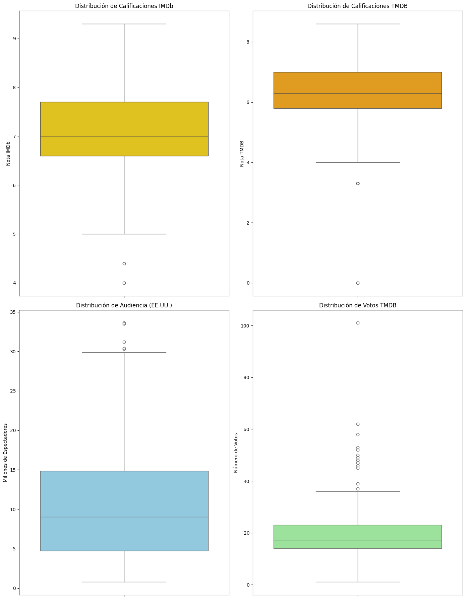
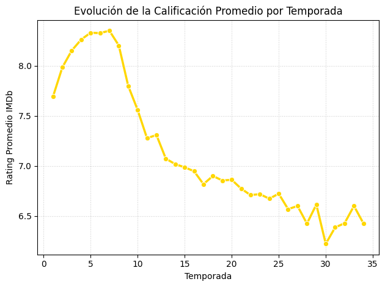
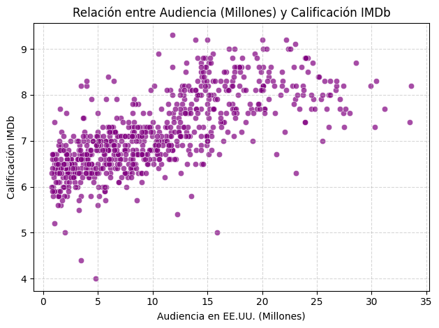
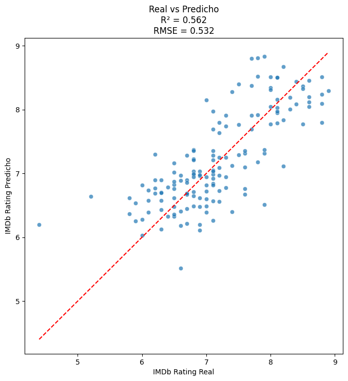
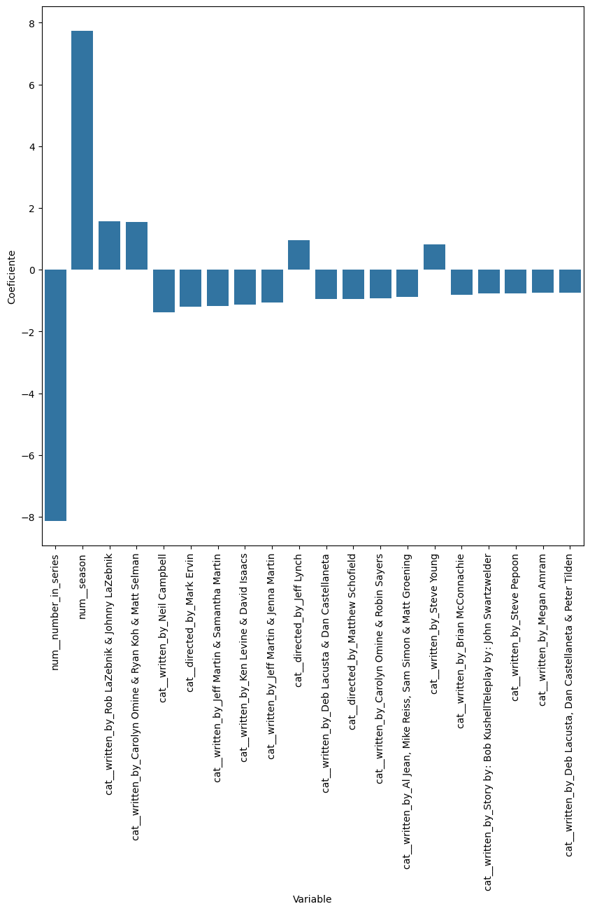
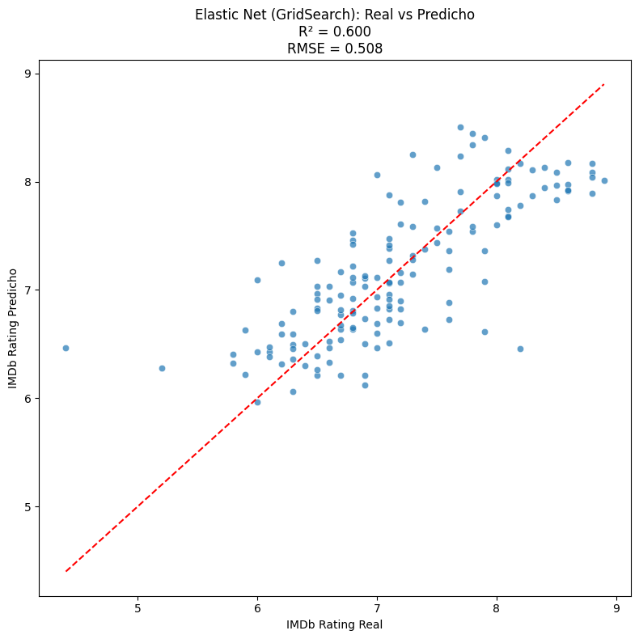

# Proyecto-1-IA-Los-Simpsons
Desarrollo de Proyecto 1 de Introducción a la Inteligencia Artificial 

## Definición del problema

### Claridad y Relevancia

El proyecto está basado en la serie norteamericana "Los Simpsons" que a lo largo de sus 39 años ha experimentado éxitos y grandes valores de sintonía como en la valoración de su audiencia. El problema consiste en analizar qué características de los episodios están asociadas a una mejor recepción por parte del público y desarrollar un modelo capaz de predecir la calificación IMDb de un episodio a partir de variables relacionadas con su producción y desempeño. Entre estas variables se consideran la temporada, el número de episodio, la audiencia en millones de espectadores, los responsables de dirección y escritura. Permitiendo todo esto comprender qué factores influyen directamente en el éxito prolongado del show.

## Plan de acción

### Descripción del dataset y fuente

El dataset contiene información de episodios de Los Simpsons. Cada registro representa un episodio e incluye variables descriptivas relacionadas con su producción, emisión y recepción por parte del público. Las principales columnas disponibles son:

- season: temporada a la que pertenece el episodio.
- number_in_season: número del episodio dentro de la temporada.
- number_in_series: número total dentro de la serie.
- directed_by: director(es) del episodio.
- written_by: guionista(s) responsables.
- us_viewers_in_millions: audiencia en millones de espectadores.
- tmdb_rating: valoración promedio en TMDB.
- tmdb_vote_count: cantidad de votos registrados en TMDB.
- imdb_rating: valoración promedio en IMDb.

Para poder explorar de manera más específica los datos se realizarán análisis exploratorios y correlaciones. Por otro lado, el dataset fue seleccionado y descargado de la plataforma [Kaggle] (https://www.kaggle.com/datasets/jonbown/simpsons-episodes-2016?select=simpsons_episodes.csv). 

## Modelo(s) seleccionado(s) y estrategia de evaluación claramente explicados

Se seleccionó un modelo de Regresión Lineal, utilizando como variable objetivo la calificación IMDb (imdb_rating). El modelo buscará estimar la puntuación de un episodio a partir de las características disponibles en el conjunto de datos, analizando la relación entre las variables predictoras y la calificación de IMDb, así como la capacidad del modelo para estimar dicha puntuación.
Para la evaluación, el conjunto de datos se dividirá en entrenamiento (80%) y prueba (20%). Posteriormente, sobre el conjunto de entrenamiento se aplicará validación cruzada K-Fold con k=5, con el fin de obtener una estimación más robusta del desempeño del modelo antes de realizar la evaluación final sobre el conjunto de prueba. El rendimiento se analizará mediante las métricas R², MAE y RMSE.

### Justifiación de modelo: ventajas, limitaciones y pertinencia.

Se seleccionó la Regresión Lineal debido a que la variable objetivo del estudio, imdb_rating, corresponde a una variable numérica continua. Este tipo de modelo permite analizar y cuantificar la relación existente entre una variable dependiente y múltiples variables explicativas, por lo que resulta adecuado para estimar la valoración de un episodio a partir de sus características. 

Entre sus principales ventajas se encuentran su simplicidad de implementación y facilidad de interpretación. Además, permite identificar qué variables tienen una mayor influencia sobre la calificación IMDb mediante el análisis de los coeficientes asociados a cada predictor. Como limitación, la regresión lineal supone que existe una relación lineal entre las variables analizadas, por lo que puede que no llegue a representar correctamente patrones más complejos. Sin embargo, este modelo resulta pertinente para el problema planteado, ya que permite predecir una variable numérica como la calificación IMDb e identificar qué factores influyen en la valoración de los episodios. Además, destaca por ser un modelo simple, fácil de interpretar y adecuado para un análisis exploratorio inicial.

## Metodología aplicada (paso a paso)

### Paso 1: Carga de librerías y data:

El proyecto comenzó con la preparación del entorno en Python, utilizando Pandas y NumPy para la manipulación de datos, Matplotlib y Seaborn para la generación de gráficos, y Scikit-Learn para el entrenamiento y evaluación del modelo. De esta librería se emplearon herramientas como GridSearchCV, validación cruzada, OneHotEncoder, StandardScaler, ColumnTransformer y Pipeline para el preprocesamiento y la optimización del modelo, además de las métricas MSE y MAE para evaluar su desempeño. Una vez configuradas las librerías, se cargó el dataset y se visualizaron las primeras 10 filas para revisar la estructura y organización de las columnas.

.png)

### Paso 2: EDA

El dataset contiene 747 episodios y 14 columnas. Al revisar su calidad, se encontró un único valor nulo en la columna us_viewers_in_millions, mientras que no existen filas duplicadas. Las repeticiones de directores, guionistas o temporadas corresponden al contenido del dataset y no representan errores, ya que un mismo director o escritor participa en varios episodios.

### Descripción del dataset

Siguiendo con la exploración inicial de la data, la siguiente imagen presenta la descripción detalladas de las columnas y sus estadísticos:

* **count**: Muestra la cantidad de datos válidos que hay. La mayoría de las columnas dicen 747.000000 (747 episodios), pero us_viewers_in_millions dice 746.000000. Significa que hay 1 episodio al que le falta el dato de audiencia, tal como se vio en el estudio de datos nulos y su cantidad. 

* **mean**: se puede ver el promedio histórico de la serie. La serie promedia 17.4 temporadas, actualmente va en la temporada 37 con más de 800 episodios pero al momento de crear este dataset se consideraron solo 747. Además tiene una sintonía histórica promedio de 10.38 millones de espectadores por capítulo y la "nota" promedio en IMDb es de 7.15 dentro del rango de 1 al 10.

* **std**: la desviación estándar muestra que la audiencia es de 6.96, lo que significa que la sintonía ha cambiado drásticamente entre temporadas; alguinos capítulos con muchísima gente y otros con muy poca.

* **min (Mínimo)**: es el punto más bajo registrado con el peor capítulo de Los Simpson teniendo un 4.0 en IMDb. Y el capítulo menos visto tuvo apenas 0.77 millones de espectadores.

* **max (Máximo)**: la serie al momento de la creación de este dataset tiene un máximo de 34 temporadas, su capítulo más visto tuvo 33.6 millones de espectadores y el capítulo mejor evaluado de la historia llegó a 9.3 en IMDb.

* **Respecto a los percentiles de 25%, 50% y 75%**: el 25% de los episodios tiene una calificación de 6.60 o menos, mientras que la mediana es 7.00. Como esta última es inferior al promedio (7.15), se observa que algunos capítulos con calificaciones muy altas elevan la media. Por último, el 75% de los episodios alcanza como máximo 7.70, por lo que solo el 25% supera esa puntuación.

A continuación, se estudiaron las variables categóricas del dataset de directores y escritores, desplegando la cantidad exacta de episodios dirigidos:

| Director | Cantidad de Episodios |
| :--- | :---: |
| Mark Kirkland | 83 |
| Steven Dean Moore | 82 |
| Bob Anderson | 64 |
| Matthew Nastuk | 57 |
| Mike Frank Polcino | 39 |
| Jim Reardon | 35 |
| Chris Clements | 32 |
| Rob Oliver | 32 |
| Nancy Kruse | 26 |
| Wes Archer | 25 |

Y escritos por cada persona para identificar a los realizadores más frecuentes del programa:

| Guionista | Cantidad de Episodios |
| :--- | :---: |
| John Swartzwelder | 55 |
| Joel H. Cohen | 32 |
| Tim Long | 27 |
| J. Stewart Burns | 25 |
| Michael Price | 25 |
| John Frink | 24 |
| Matt Selman | 24 |
| Jeff Westbrook | 22 |
| Jon Vitti | 22 |
| Carolyn Omine | 19 |

Para entender cómo se relacionan la recepción crítica (IMDB y TMDB) y la popularidad de los episodios, se generaron cuatro boxplots combinando distintas variables del dataset:

* Boxplot 1: Calificaciones de IMDb.
* Boxplot 2: Calificaciones de TMDB.
* Boxplot 3: Calificaciones de Audiencia en millones.
* Boxplot 4: Calificaciones de Distribución de votos.

Se realizaron boxplots únicamente para las variables numéricas continuas (imdb_rating, tmdb_rating, us_viewers_in_millions y tmdb_vote_count), ya que permiten analizar su distribución e identificar posibles valores atípicos. En cambio, las variables discretas, como el número de temporada o de episodio, no entregan información relevante mediante este tipo de gráfico.

1. Distribución de Calificaciones IMDb:
El boxplot muestra que las calificaciones de IMDb presentan una distribución donde la mediana es de 7.0 y el promedio de 7.15, lo que indica que las puntuaciones se mantienen cercanas entre sí. El 50 % de los episodios tiene calificaciones entre 6.6 y 7.7 (primer y tercer cuartil). Además, las calificaciones alcanzan un máximo de 9.3, mientras que el límite inferior llega hasta 5.0. También se observan dos valores atípicos, con calificaciones de 4.4 y 4.0, correspondientes a los episodios con menor puntuación.

2. Distribución de Calificaciones TMDB: 
En el caso de TMDB, la mediana es de 6.3 y el promedio de 6.37, por lo que las calificaciones son ligeramente menores que en IMDb. El 50 % de los episodios se concentra entre 5.8 y 7.0. La calificación máxima es de 8.6 y el límite inferior llega a 4.0. Además, el gráfico presenta dos valores atípicos por debajo de ese límite, uno cercano a 3.0 y otro con una calificación de 0.0, que podría corresponder a un dato atípico o un posible error de registro.

3. Distribución de Audiencia en EE.UU:
El boxplot de audiencia muestra una mayor variabilidad que las calificaciones. La mediana es de aproximadamente 9 millones de espectadores y el promedio de 10.38 millones. El 50 % de los episodios registra entre 4.7 y 14.8 millones de espectadores. La audiencia mínima es de 0.77 millones, mientras que el límite superior alcanza los 30 millones. Además, se observan tres valores atípicos por encima de este valor, correspondientes a episodios con una audiencia excepcionalmente alta.

4. Distribución de votos TMDB:
El boxplot indica que la mediana es de aproximadamente 17 mil votos y el promedio de 18.07 mil. El 50 % de los episodios concentra entre 14 mil y 23 mil votos. El mínimo registrado es de 1.2 mil votos y el máximo de 36 mil. Sin embargo, el gráfico presenta numerosos valores atípicos superiores, que van desde 37 mil hasta más de 100 mil votos, lo que evidencia que algunos episodios recibieron una cantidad de votaciones muy superior al resto.

Para comparar la opinión de la audiencia a lo largo del tiempo, se graficó la evolución del puntaje promedio de IMDb por temporada. Esto permitió identificar la llamada "época dorada" de Los Simpson y observar en qué momento comenzaron a disminuir sus calificaciones.

El gráfico muestra la evolución del rating promedio de IMDb por temporada. Se observa una "época dorada" entre las temporadas 1 y 8, con un máximo cercano a 8.3 puntos en la temporada 7. A partir de la temporada 9 comienza un descenso en las calificaciones, estabilizándose entre 6.5 y 7.0 en las temporadas más recientes, con un leve repunte al final.

Siguiendo con el análisis de calidad, se generó un gráfico para identificar a los directores mejor evaluados en IMDb y descubrir quiénes están detrás de los capítulos con las notas más altas de la serie.

El gráfico muestra que dirigir más episodios no implica obtener mejores calificaciones. Aunque algunos directores participaron en una gran cantidad de capítulos, los promedios más altos corresponden principalmente a quienes trabajaron durante las primeras temporadas. Esto sugiere que la época de la serie tuvo mayor influencia en las calificaciones que la cantidad de episodios dirigidos.

De igual manera se realizó algo similiar con los escritores:

Bill Oakley y Josh Weinstein lideran el análisis de guionistas con un promedio de 8.25, seguidos por Mike Scully y el dúo de Kogen & Wolodarsky, mientras John Swartzwelder destaca por mantener un alto nivel (7.9) a pesar de ser el más frecuente. En contraste nuevamente, una alta producción de episodios no garantiza calidad, evidenciado por el promedio de 7.15 de Al Jean, mostrando que las temporadas más recientes presentan calificaciones menores a las de las primras temporadas.

Se realizó también un scatterplot para analizar la relación entre la audiencia y la calificación IMDb. El gráfico muestra una tendencia positiva en la mayoría de los episodios: a mayor audiencia, mejores calificaciones. Sin embargo, en los episodios con audiencias más altas esta relación deja de ser lineal, lo que indica que una mayor cantidad de espectadores no garantiza una mejor valoración.

Finalmente, se hizo una matriz de correlación para mostrar posibles relaciones entre variables no estudiadas:

La matriz de correlación muestra que las variables relacionadas con IMDb y TMDb tienen una relación positiva entre sí, por lo que los episodios mejor evaluados también suelen recibir más votos. Además, una mayor audiencia tiende a asociarse con mejores calificaciones. En cambio, a medida que avanzan las temporadas y los episodios, se observa una disminución tanto en la audiencia como en las valoraciones.

### Paso 3: Feature Engineering:

A continuación, se realizó la etapa de Feature Engineering, en la que se prepararon las variables antes del entrenamiento del modelo. Se eliminaron las columnas id, title, description, original_air_date y production_code, ya que no eran adecuadas como variables de entrada. Además, se descartó tmdb_rating por su alta correlación con imdb_rating, con el fin de reducir la redundancia entre variables. Posteriormente, se eliminaron las filas con valores nulos en us_viewers_in_millions y, finalmente, el dataset se dividió en las variables predictoras (X) y la variable objetivo (y).

### Paso 4: Feature Selection: 

Durante la preparación del modelo, el dataset se dividió con train_test_split, destinando el 80% de los datos para entrenamiento y el 20% para prueba. Posteriormente, mediante ColumnTransformer, las variables numéricas (temporada, número de episodio, número global y audiencia) se normalizaron con StandardScaler, mientras que las variables categóricas correspondientes a directores y guionistas se transformaron con OneHotEncoder.

### Paso 5: Entrenamiento:

Durante la fase de entrenamiento, se utilizó el Pipeline para conectar directamente la preparación de los datos con el algoritmo de regresión lineal.

Antes del ajuste final, se aplicó una validación cruzada en 5 folds mediante *cross_val_score*, midiendo el rendimiento con el coeficiente R². Se evaluó entonces el pipeline de esta forma para evitar el data leakage. Finalmente, el modelo se entrenó de forma definitiva con el método *.fit()* utilizando el 80% de los datos. 

### Paso 6: Control de overfitting:

Una vez completado el entrenamiento, se evaluó si existía un problema de overfitting comparando el rendimiento del modelo en los datos de train frente al resultado de la validación cruzada. Al usar los mismos datos de entrenamiento, el modelo obtuvo un R² de *0.775*, lo que sugería que explicaba el 77.5% de la variabilidad de las notas de IMDb. Sin embargo, al sacar las cinco partes de la validación cruzada en promedio, el resultado bajó hasta un 0.441. Esta diferencia entre ambos R muestra un overfitting. Esto debido a que el algoritmo aprendió demasiado bien y se sugiere que el modelo generaliza peor sobre datos no vistos.

Con el objetivo de reducir este sobreajuste, se evaluaron técnicas de regularización, las cuales penalizan la complejidad del modelo para favorecer una mejor capacidad de generalización. En particular, se probaron las regularizaciones Ridge (L2) y Lasso (L1). Se probó Ridge porque reduce el tamaño de los coeficientes del modelo, ayudando a disminuir el overfitting sin eliminar variables.

| Modelo | R² (Cross validation) |
| :--- | :---: |
| Regresión Lineal | 0.441 |
| Ridge | 0.558 |
| Lasso | 0.565 |
| Elastic Net | 0.589 |

Por su parte, la regularización Lasso (L1) también se evaluó porque, además de reducir el overfitting, puede eliminar automáticamente variables poco relevantes al llevar algunos coeficientes a cero. Finalmente se probó Elastic Net, que combina las ventajas de Ridge y Lasso, buscando un mejor equilibrio entre ambas técnicas.

Al comparar los resultados obtenidos mediante validación cruzada, tanto Ridge como Lasso mejoraron el desempeño del modelo respecto a la regresión lineal sin regularización. Ridge alcanzó un R² promedio de *0,558*, mientras que Lasso obtuvo un R² promedio de *0,560*, aunque la diferencia entre ambos modelos fue mínima. Por otro lado, Elastic Net mejoró la capacidad de generalización del modelo, siendo este el que obtuvo el mejor desempeño con R² = *0.58*, al combinar las ventajas de las penalizaciones L1 y L2. Estos resultados indican que la incorporación de regularización permitió controlar el sobreajuste y mejorar la capacidad de generalización del modelo sobre datos no utilizados durante el entrenamiento.

### Paso 7: Testeo de Regresión Lineal:

A partir de los resultados de la validación cruzada, se observa que Elastic Net es el algoritmo que mejor controla el overfitting al balancear las variables. Sin embargo, para establecer un "caso base" de comparación, se avanzará primero con el testeo de la Regresión Lineal clásica (sin regularizadores) para analizar su rendimiento final, para luego contrastarlo definitivamente con los resultados optimizados de Elastic Net. Por tanto en esta fase se evalúa el modelo en el conjunto de test pasándolo por el pipeline para ver cómo generaliza.

### Paso 8: Visualización de resultados Y Métricas: Regresión lineal:

Para evaluar el desempeño del modelo se utilizaron las métricas MAE, RMSE y R². El modelo obtuvo un MAE de 0.424 y un RMSE de 0.532, lo que indica que las predicciones presentan un error promedio cercano en la escala de calificaciones de IMDb. Además, el coeficiente de determinación R² fue de 0.562, por lo que el modelo explica aproximadamente el 56.2% de la variabilidad de las calificaciones a partir de las variables utilizadas. Estos resultados indican que el modelo posee una capacidad predictiva moderada, aunque existen otros factores que también influyen en la calificación de los episodios.

El gráfico de dispersión confirma que el modelo de regresión lineal funciona de manera consistente, ya que los puntos azules se agrupan en torno a la línea diagonal roja que representa las predicciones exactas. Esta distribución valida los resultados numéricos obtenidos, donde el indicador R² de *0.562* demuestra que las variables utilizadas explican el *56.2*% de la variación en las notas. 

Al analizar igualmente los coeficientes obtenidos por el modelo, se identificaron las variables que más influyen en la predicción del puntaje, tanto a nivel temporal como por el impacto de los equipos creativos:

Como se muestra en la gráfica, el num_season tiene una fuerte influencia positiva en el rating de los episodios a medida que avanzan las temporadas. Fuera de estas métricas temporales, el impacto de los creadores es disferente: las variables asociadas a los guiones de Rob & Johnny LaZebnik (+1.56) y Carolyn Omine, Ryan Koh & Matt Selman (+1.55) presentan los coeficientes positivos más altos respecto a la categoría de referencia del One-Hot Encoding, indicando una asociación con mayores valores predichos de IMDb Rating. Por otro lado, el guión de Neil Campbell (-1,38) y la dirección de Mark Ervin (-1,21) presentan los coeficientes negativos más grandes respecto a la referencia.

### Paso 9: Evaluación comparativa con Elastic Net:

Dado que Elastic Net obtuvo el mejor desempeño durante la etapa de validación cruzada (R² = *0.58*), se utilizó este modelo para el testeo, no se volvió a entrenar porque el entrenamiento ya fue hecho previamente. El objetivo es comparar su rendimiento en el conjunto de prueba con el obtenido previamente por la regresión lineal sin regularización y evaluar si la incorporación de un regularizador mejora la capacidad de generalización del modelo.

Al comparar ambos modelos, se observa que la incorporación de la regularización mediante Elastic Net mejoró el desempeño predictivo respecto a la regresión lineal sin regularización. El coeficiente de determinación (R²) aumentó de 0.562 (LR sin penalización) a 0.600, indicando que el modelo logra explicar una mayor proporción de la variabilidad de la variable objetivo. Asimismo, el MAE disminuyó de 0.424 a 0.390 y el RMSE de 0.532 a 0.508, lo que significa que, en promedio, las predicciones presentan un menor error. Estos resultados sugieren que la regularización ayudó a reducir el sobreajuste y mejoró la capacidad de generalización del modelo sobre datos no vistos.

Además, la gráfica de dispersión muestra la relación entre las calificaciones reales de IMDb y las predicciones calculadas por el modelo Elastic Net. En la imagen se observa que la mayoría de los puntos se agrupan de manera muy similar al scatterplot de LR, mas en este caso siendo respaldado por un indicador R² = *0.600* y un nivel de error RMSE = *0.508*, es mejor y distinto. Esto demuestra que el sistema tiende a moderar las calificaciones extremas y se concentra en asegurar un cálculo preciso y estable para la gran mayoría de los episodios ubicados en la zona central de la distribución.

## Resultados 

Al evaluar el modelo clásico de regresión lineal, se demostró que este se aprendió de memoria las características del conjunto de entrenamiento. El R²  en esa primera etapa fue de *0.775* lo que indicaba que explicaba el *77.5*% de la variabilidad interna. Sin embargo, al aplicar la validación cruzada sobre esos mismos datos, el rendimiento cayó a un *0.441*. Esta gran diferencia mostroó que había overfitting, ya que al tener más de 100 columnas debido a la codificación de tantos nombres de directores y escritores, el algoritmo terminó memorizando el ruido de los datos en lugar de aprender el patrón general. Para solucionar esto, se aplicó el regulador Elastic Net. En el conjunto de prueba definitivo, este nuevo enfoque arrojó resultados superiores y mejores:

| Modelo | R² (Validación Cruzada) | R² (Testeo Final) | MAE (Testeo) | RMSE (Testeo) |
| :--- | :---: | :---: | :---: | :---: |
| **Regresión Lineal Clásica** | 0.441 | 0.562 | 0.424 | 0.532 |
| **Ridge** | 0.558 | *—* | *—* | *—* |
| **Lasso** | 0.565 | *—* | *—* | *—* |
| **Elastic Net** | 0.589 | **0.600** | **0.395** | **0.508** |

Al analizar de forma crítica las gráficas de dispersión, se nota cómo la regularización de Elastic Net mejoró el comportamiento general. En la primera gráfica (Regresión Lineal), la nube de puntos azules se encontraba más dispersa respecto a la línea roja ideal. En cambio, en la gráfica de Elastic Net, los puntos se agruparon de forma mucho más compacta y ordenada siguiendo la diagonal. El indicador $R^2$ subió a un *0.600*, confirmando que el modelo final logra explicar con éxito el *60*% de la variación en las notas de IMDb de la serie.

Considerando el todos los modelos y técnicas de aprendizaje analizados a lo largo del curso, la estrategia de modelamiento no se limitó únicamente a la evaluación de regresiones lineales con penalización. Con el objetivo de garantizar la robustez metodológica del proyecto y justificar de manera rigurosa la elección de Elastic Net como el estimador definitivo, se evaluó la viabilidad teórica y práctica de otros algoritmos frente a las particularidades del conjunto de datos de Los Simpson. Las razones detrás del descarte de estos modelos son:

* **Regresión logística**: No se utilizó porque este algoritmo está diseñado para problemas de clasificación y debido a la naturaleza de la variable objetivo (imdb_rating). Mientras que la regresión logística es un algoritmo de clasificación diseñado para predecir probabilidades y resultados categóricos binarios.

* **PCA** : no se seleccionó debido a que el conjunto de datos cuenta con un número reducido de variables (14 columnas), por lo que no existía un problema de alta dimensionalidad. Además, el uso de PCA transforma las variables originales en componentes principale, reduciendo la interpretabilidad del modelo e impide medir el impacto directo de cada director y guionista en el rating de la serie.

* **Naive Bayes**: Naive Bayes es un algoritmo de clasificación diseñado para predecir categorías o etiquetas discretas. Dado que el objetivo de este proyecto es predecir el imdb_rating que es un puntaje numérico continuo, este algoritmo resulta inaplicable. Además, aunque el dataset contiene variables de texto (como los nombres de directores y guionistas), estas funcionan como variables categóricas que influyen en una escala numérica, por lo que el problema no requiere visión de clasificación.

* **K-Nearest Neighbors (KNN)**: se descartó su aplicación porque al aplicar One-Hot Encoding sobre las variables de directores y guionistas (que son categóricas con múltiples niveles), el dataset se expandió a un espacio de alta dimensionalidad y puede aparecer la "curse of dimensionality".

* **Decision Trees**: se descartó su uso debido a sus desventajas. Ya que los árboles de decisión son altamente propensos al overfitting, tendiendo a memorizar el ruido de los datos de entrenamiento cuando se trabaja con datasets pequeños como este de 747 filas. Al haber expandido las categorías de directores y guionistas mediante One-Hot Encoding, el algoritmo generaría árboles complejos.

* **Random Forest**: este algoritmo es muy bueno contra el overfitting, se descartó debido a su naturaleza de "black box". Al hacer bagging promediando las predicciones de múltiples árboles entrenados con subconjuntos aleatorios de datos y características, se pierde la trazabilidad de los coeficientes.

## Conclusiones

Este proyecto demuestra que se puede predecir con mediana precisión qué tan bueno será un capítulo de Los Simpson usando solo datos de su producción y audiencia. El modelo final acertó que sus predicciones fallan, en promedio por 0.4 puntos en la escala de IMDb, un resultado bueno para medir algo tan variable como el gusto de la gente.El análisis por otro lado confirmó que el éxito y la buena calificación de un episodio dependen directamente de quién escribe el guion y quién lo dirige. Sin embargo, la cantidad no asegura la calidad: que un director o guionista haga muchísimos capítulos no significa que vayan a ser los mejores, ya que el éxito está amarrado a la identidad creativa de su autor y a su época en la serie.  
Finalmente, la selección de los algoritmos permitió mantener un enfoque acorde con los objetivos del proyecto. Se descartaron modelos que no eran adecuados para predecir una variable continua o que podían presentar problemas de overfitting o de interpretación. Por ello, se optó por un modelo lineal con y sin regularización, ya que se ajusta bien a un conjunto de datos pequeño (747 filas), reduce el riesgo de overfitting y permite interpretar fácilmente la influencia de cada variable sobre la calificación IMDb.

## Referencias

* Fandom. (s.f.). *Categoría:Directores*. Los Simpson Wiki. [https://simpsons.fandom.com/es/wiki/Categor%C3%ADa:Directores](https://simpsons.fandom.com/es/wiki/Categor%C3%ADa:Directores)
* Fandom. (s.f.). *Categoría:Guionistas de Los Simpson*. Los Simpson Wiki. [https://simpsons.fandom.com/es/wiki/Categor%C3%ADa:Guionistas_de_Los_Simpson](https://simpsons.fandom.com/es/wiki/Categor%C3%ADa:Guionistas_de_Los_Simpson)
* IBM. (2025). *¿Qué es la multicolinealidad?* IBM Think Topics. [https://www.ibm.com/es-es/think/topics/multicollinearity](https://www.ibm.com/es-es/think/topics/multicollinearity)
* IBM. (2025). *What is data leakage in machine learning?* IBM Think Topics. [https://www.ibm.com/think/topics/data-leakage-machine-learning](https://www.ibm.com/think/topics/data-leakage-machine-learning)
* Sharma, A. (2022, 12 de julio). *Step-by-step exploratory data analysis (EDA) using Python*. Analytics Vidhya. [https://www.analyticsvidhya.com/blog/2022/07/step-by-step-exploratory-data-analysis-eda-using-python/](https://www.analyticsvidhya.com/blog/2022/07/step-by-step-exploratory-data-analysis-eda-using-python/)
* Singh, A. (2023, 22 de diciembre). *Building smarter ML pipelines with column transformers*. Medium. [https://medium.com/@abhaysingh71711/building-smarter-ml-pipelines-with-column-transformers-895904e97254](https://medium.com/@abhaysingh71711/building-smarter-ml-pipelines-with-column-transformers-895904e97254)
* Zhihu. (2023, 11 de mayo). *Respuesta a una consulta de ML* (Respuesta N.º 3002775487). Zhihu. [https://www.zhihu.com/en/answer/3002775487](https://www.zhihu.com/en/answer/3002775487) 
* Lindeman, M., PhD. (s. f.). *Logistic Regression vs Linear Regression: When to Use Which*. Quadratic. [https://www.quadratichq.com/blog/logistic-regression-vs-linear-regression-when-to-use-which-approach](https://www.quadratichq.com/blog/logistic-regression-vs-linear-regression-when-to-use-which-approach)
* Loukas, S., PhD. (2025, 21 de enero). *PCA clearly explained – How, when, why to use it and feature importance: A guide in Python*. Towards Data Science. [https://towardsdatascience.com/pca-clearly-explained-how-when-why-to-use-it-and-feature-importance-a-guide-in-python-7c274582c37e/](https://towardsdatascience.com/pca-clearly-explained-how-when-why-to-use-it-and-feature-importance-a-guide-in-python-7c274582c37e/)
* GeeksforGeeks. (2026, 27 de febrero). *Naive Bayes classifiers*. GeeksforGeeks. [https://www.geeksforgeeks.org/machine-learning/naive-bayes-classifiers/](https://www.geeksforgeeks.org/machine-learning/naive-bayes-classifiers/)
* Kartik, N. (2026, 14 de mayo). *K-Nearest Neighbor (KNN) in 2026: How It Works and When to Use It*. Future AGI. [https://futureagi.com/blog/k-nearest-neighbor/](https://futureagi.com/blog/k-nearest-neighbor/)
* Dun, O. (2025, 26 de febrero). *Árboles de Decisión en Machine Learning: Predicciones efectivas y modelos interpretables*. Codemotion Magazine. [https://www.codemotion.com/magazine/es/inteligencia-artificial/arboles-de-decision-en-machine-learning-predicciones-efectivas-y-modelos-interpretables/](https://www.codemotion.com/magazine/es/inteligencia-artificial/arboles-de-decision-en-machine-learning-predicciones-efectivas-y-modelos-interpretables/)
* H2O.ai. (s. f.). *How Is Random Forest Used For Classification and Regression Problems?*. H2O.ai Wiki. [https://h2o.ai/wiki/random-forest/](https://h2o.ai/wiki/random-forest/)
